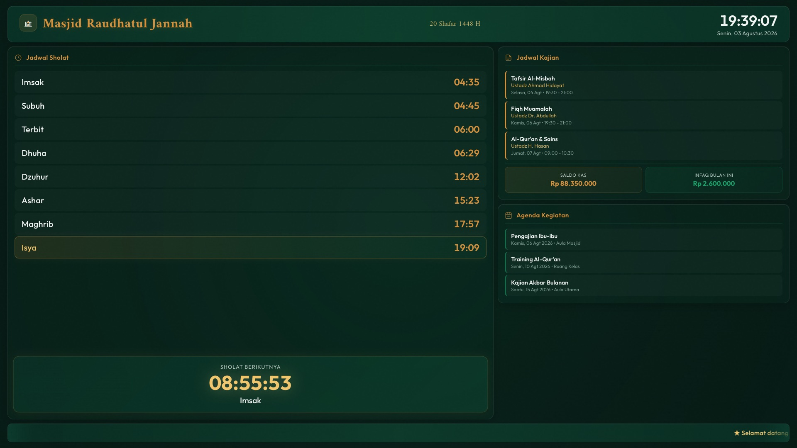
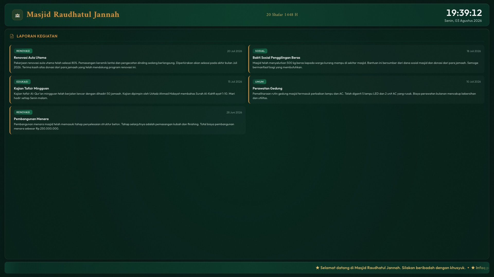
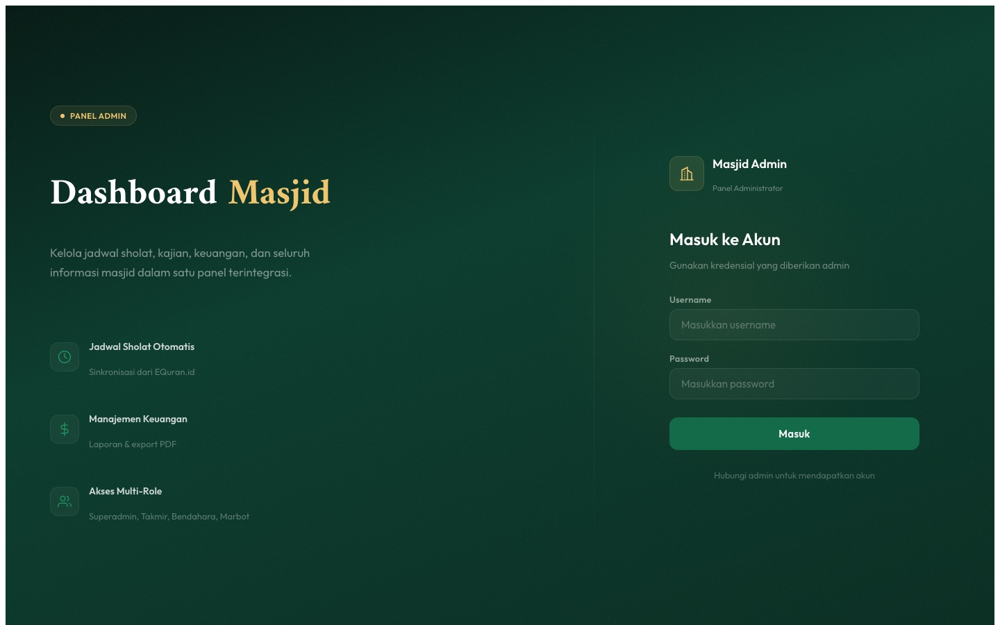
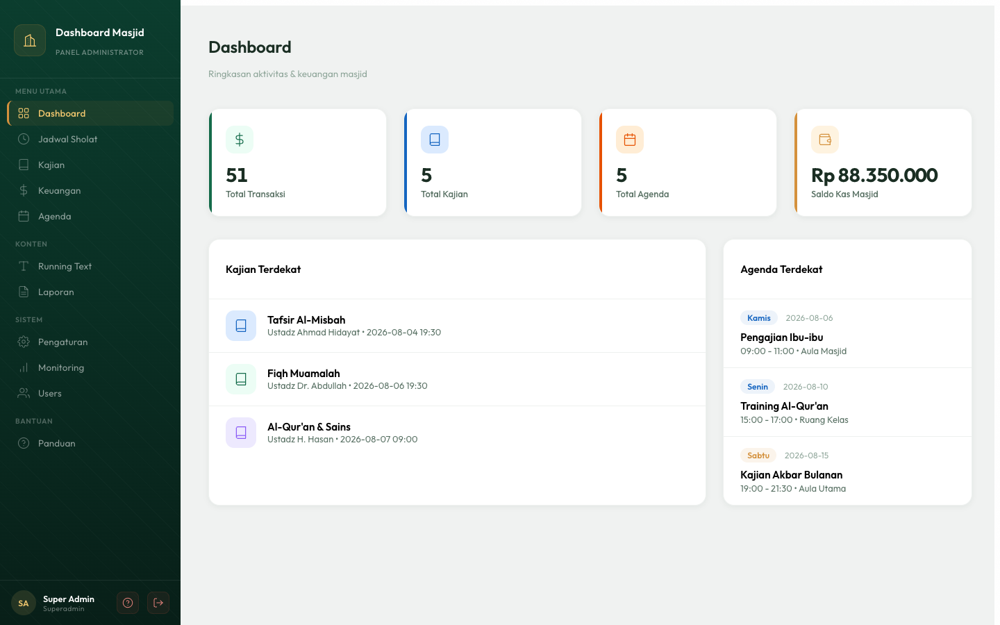
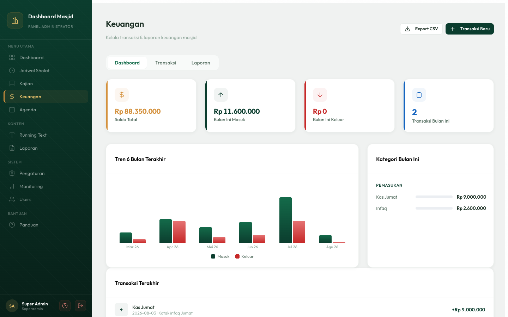
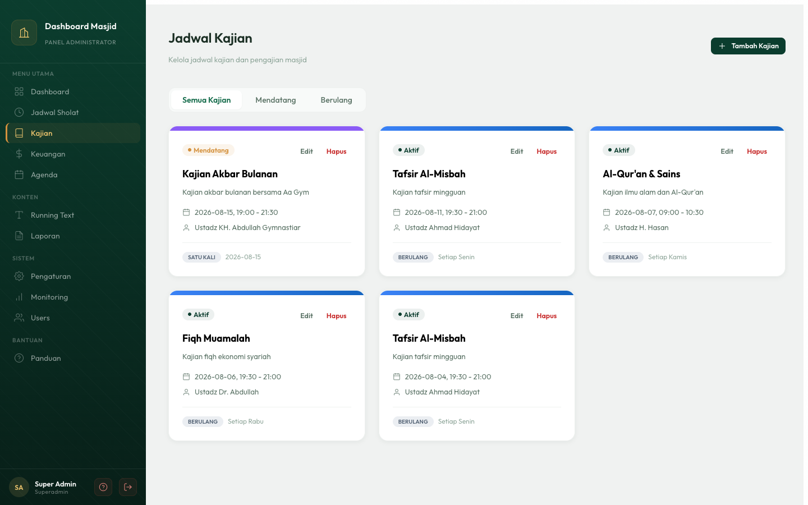
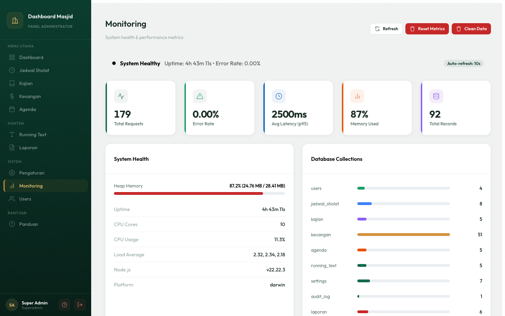
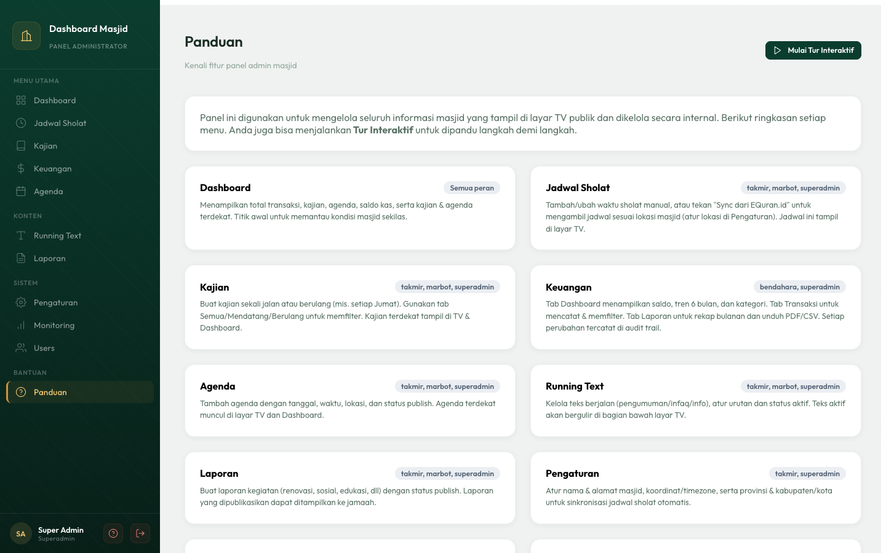
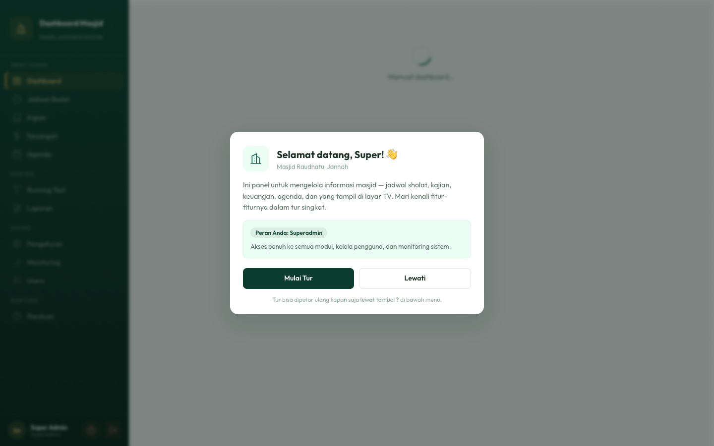
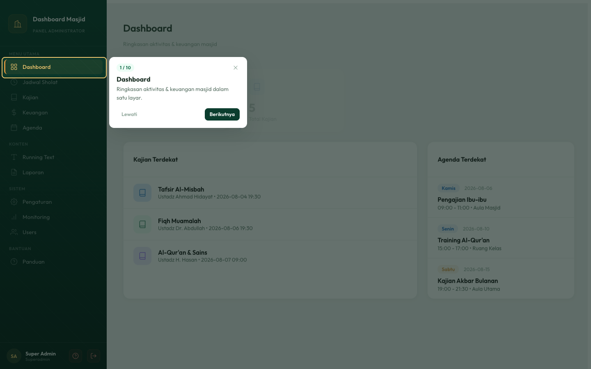

<div align="center">

# 🕌 Dashboard Informasi Masjid

**Solusi lengkap dashboard masjid — tampilan TV untuk jamaah + panel admin untuk pengurus.**

[](https://vercel.com/clone?repository-url=https%3A%2F%2Fgithub.com%2FValerian69%2Fmasjid&env=SUPABASE_URL,SUPABASE_ANON_KEY,SUPABASE_SERVICE_ROLE_KEY,JWT_SECRET&envDescription=Get%20these%20from%20Supabase%20%2B%20generate%20JWT%20secret&envLink=https%3A%2F%2Fgithub.com%2FValerian69%2Fmasjid%2Fblob%2Fmain%2FSETUP.md)

[Live Demo](https://masjid-umber.vercel.app/tv/) · [Admin Panel](https://masjid-umber.vercel.app/admin/) · [Setup Guide](SETUP.md)

</div>

---

## Fitur

### TV Display (Publik)
- Jadwal sholat dengan **countdown animasi** ke sholat berikutnya
- Jadwal kajian terdekat
- Running text pengumuman (auto-scroll)
- Info keuangan ringkas (saldo & infaq bulanan)
- Agenda kegiatan mendatang
- Laporan kegiatan
- Tanggal Hijriah (otomatis)
- Desain glassmorphism dengan ambient glow

### Admin Panel
- Dashboard ringkasan (total transaksi, kajian, agenda, saldo)
- Manajemen Jadwal Sholat (CRUD + status aktif/nonaktif)
- Manajemen Kajian (CRUD + jadwal berulang)
- Manajemen Keuangan (CRUD + filter + laporan bulanan + export PDF/CSV)
- Manajemen Agenda (CRUD + publish/draft)
- Manajemen Running Text (CRUD + urutan)
- Manajemen Laporan Kegiatan
- Manajemen Users (role-based access control)
- Monitoring sistem (uptime, memory, CPU)
- Audit trail perubahan data keuangan
- **Onboarding pengguna pertama kali** — welcome modal + tur interaktif (spotlight tiap menu), sadar-role
- **Halaman Panduan** — dokumentasi fitur + tabel peran, bisa diakses kapan saja
- Notifikasi toast, modal konfirmasi, loading/empty/error state di semua modul

## 📸 Tampilan Aplikasi

### TV Display (layar publik)

Layar untuk publik: jadwal sholat + countdown ke sholat berikutnya, kajian, ringkasan keuangan, agenda, dan running text — rotasi halaman otomatis dengan transisi halus.





### Admin Panel

Panel internal untuk mengelola seluruh konten, dengan akses berbasis peran dan design system emerald–amber.

<table>
  <tr>
    <td width="50%"><br><sub><b>Login</b> — split emerald + amber</sub></td>
    <td width="50%"><br><sub><b>Dashboard</b> — ringkasan aktivitas & keuangan</sub></td>
  </tr>
  <tr>
    <td><br><sub><b>Keuangan</b> — saldo, tren 6 bulan, kategori</sub></td>
    <td><br><sub><b>Kajian</b> — grid kartu + filter</sub></td>
  </tr>
  <tr>
    <td><br><sub><b>Monitoring</b> — kesehatan sistem & DB</sub></td>
    <td><br><sub><b>Panduan</b> — dokumentasi fitur + peran</sub></td>
  </tr>
</table>

### Onboarding (panduan pengguna pertama kali)

Muncul otomatis saat login pertama; bisa diputar ulang kapan saja lewat tombol **?**.

<table>
  <tr>
    <td width="50%"><br><sub><b>Welcome modal</b> — sapaan + ringkasan peran</sub></td>
    <td width="50%"><br><sub><b>Tur interaktif</b> — spotlight tiap menu</sub></td>
  </tr>
</table>

## Tech Stack

| Layer | Technology |
|-------|-----------|
| Backend | Node.js + Express |
| Database | Supabase (PostgreSQL) |
| TV Display | React.js 18 + Moment.js |
| Admin Panel | React.js 18 + Material UI v5 |
| Hosting | Vercel (serverless) |

## Quick Start (Deploy Sendiri)

### Step 1: Buat Supabase Project (Gratis)

1. Buka [supabase.com](https://supabase.com) → Sign up / Login
2. Klik **"New project"**
3. Isi nama project, database password, pilih region
4. Tunggu hingga project selesai dibuat

### Step 2: Setup Database

1. Di Supabase Dashboard, buka tab **"SQL Editor"**
2. Klik **"New query"**
3. Copy-paste isi file [`supabase/schema.sql`](supabase/schema.sql) → klik **"Run"**
4. Buka query baru → copy-paste isi [`supabase/seed.sql`](supabase/seed.sql) → klik **"Run"**

### Step 3: Ambil API Keys

1. Di Supabase Dashboard, buka tab **"Settings" → "API"**
2. Copy 3 nilai ini:
   - **Project URL** → `SUPABASE_URL`
   - **anon public** key → `SUPABASE_ANON_KEY`
   - **service_role** key → `SUPABASE_SERVICE_ROLE_KEY`

### Step 4: Deploy ke Vercel

Klik tombol **"Deploy to Vercel"** di atas → isi env vars → klik Deploy.

Atau manual:
```bash
# Clone repo
git clone https://github.com/Valerian69/masjid.git
cd masjid

# Install dependencies
npm run install:all

# Jalankan lokal
cd backend && npm run dev
```

### Step 5: Buka Dashboard

| URL | Keterangan |
|-----|-----------|
| `https://your-app.vercel.app/tv/` | TV Display (tampilan publik) |
| `https://your-app.vercel.app/admin/` | Admin Panel |

**Login:** `admin` / `admin123`

> **Penting:** Setelah deploy, ganti password default untuk keamanan!

## Role & Permissions

| Role | Akses |
|------|-------|
| `superadmin` | Full akses semua fitur + kelola user |
| `takmir` | Kelola jadwal, kajian, agenda, running text, laporan, settings |
| `bendahara` | Kelola keuangan (masuk/keluar) |
| `marbot` | Kelola jadwal, kajian, agenda, running text, laporan |

## Struktur Project

```
masjid/
├── api/                    # Vercel serverless entry point
│   ├── index.js            # Express handler
│   ├── package.json        # API dependencies
│   └── backend/            # Backend copy untuk Vercel
├── backend/                # Express backend (local dev)
│   ├── server.js
│   ├── database.js         # Supabase client
│   ├── routes/             # 10 API route files
│   ├── middleware/          # Auth + monitoring
│   └── scripts/            # Seed script
├── frontend/
│   ├── tv-display/         # React TV display
│   └── admin-panel/        # React admin panel
├── supabase/
│   ├── schema.sql          # Database schema
│   └── seed.sql            # Sample data
├── tv/                     # Built TV files (Vercel)
├── admin/                  # Built admin files (Vercel)
└── vercel.json             # Vercel config
```

## Environment Variables

| Variable | Description | Where to get |
|----------|-------------|-------------- |
| `SUPABASE_URL` | Supabase project URL | Supabase Dashboard → Settings → API |
| `SUPABASE_ANON_KEY` | Supabase anonymous key | Supabase Dashboard → Settings → API |
| `SUPABASE_SERVICE_ROLE_KEY` | Supabase service role key | Supabase Dashboard → Settings → API |
| `JWT_SECRET` | Secret for JWT tokens | Generate random string |
| `REACT_APP_API_URL` | API URL (local dev only) | `http://localhost:5001/api` |

## Local Development

```bash
# 1. Clone & install
git clone https://github.com/Valerian69/masjid.git
cd masjid
npm run install:all

# 2. Setup .env
cp .env.example backend/.env
# Edit backend/.env dengan values Supabase kamu

# 3. Jalankan dalam 3 terminal terpisah:
cd backend && npm run dev          # Port 5001
cd frontend/tv-display && npm start # Port 3000
cd frontend/admin-panel && PORT=3001 npm start # Port 3001
```

## API Endpoints

Lihat lengkapnya di [CLAUDE.md](CLAUDE.md) atau [SETUP.md](SETUP.md).

## Contributing

1. Fork repo ini
2. Buat branch baru (`git checkout -b feature/fitur-baru`)
3. Commit perubahan (`git commit -m 'Add fitur baru'`)
4. Push ke branch (`git push origin feature/fitur-baru`)
5. Buka Pull Request

## License

[MIT](LICENSE)

## Credits

Dibuat untuk membantu masjid mengelola informasi secara digital.
